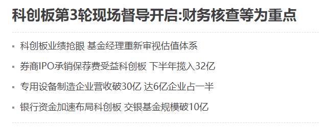

# 知识点

符合选择器、背景样式

## 题目1（加强训练）

​		页面中市场需要使用列表方式展示一些文字信息，并使用一些虚线间隔开标题和主题内容，如下图所示，在鼠标经过的时候文本有特殊的字体颜色，请使用css和html代码完成下面效果。



### 训练目标

能使用边框设置虚线、能使用外边距设置标签之间的距离让标签居中

### 训练提示

1、边框设置主题内容上下的虚线。

2、显示的文本可以用外边距、或者行高来间隔开文本的距离。

3、使用链接伪类来设置鼠标经过的样式

### 参考方案

使用边框设置虚线、使用外边距拉开不同行之间的上下距离

### 操作步骤

1、清除浏览器默认内外边距

2、创建一个最外层标签div.box，使用margin让其在浏览器中水平居中

3、在div.box中创建子标签，h1+ p*4，不设置宽度，让宽度和div.box保持一致

4、给p设置上下外边距来间隔开不同行文本的距离

6、通过设置链接伪类来实现鼠标经过字体颜色变色的效果

### 参考答案

HTML代码

```html
<div>
		<h2>科创板第3轮现场督导开启:财务核查等为重点</h2>
		<p>科创板业绩抢眼 基金经理重新审视估值体系</p>
		<p>券商IPO承销保荐费受益科创板 下半年揽入32亿</p>
		<p>专用设备制造企业营收破30亿 达6亿企业占一半</p>
		<p>银行资金加速布局科创板 交银基金规模破10亿</p>
</div>
```

CSS代码

~~~css
/*去除浏览器的内外边距*/
* {
    margin: 0;
    padding: 0;
}
div{
    width: 603px;
    height: 226px;
    /*background-color: pink;*/
    /*如果想让一个有宽度的块级标签在父盒子中居中  给当前标签设置margin:0 auto;*/
    margin:20px auto;
    border-bottom: 1px dashed #999;
}
div h2 {
    font-size: 28px;
    border-bottom: 1px dashed #999;
    padding-bottom: 20px;
}
div p {
    background-image: url(dian.png);
    background-repeat: no-repeat;
    background-position: left center;
    padding-left: 15px;
    padding-top: 10px;
    padding-bottom: 10px;
}
~~~


## 题目2（加强训练）

​		在页面中，页面的头部往往有快捷导航栏，可以让用户快速跳转到不同的页面中。如下图所示：


### 训练目标

能够使用display属性、能够制作竖线

### 训练提示

1、如何设置a链接可以设置宽高？

2、如何间隔开不同a链接的左右上下距离？

3、如何制作竖线

### 参考方案

使用display显示模式，使用1px盒子制作竖线

### 操作步骤

1、创建div.box，设置左侧内边距来间隔开内容和左侧的距离

2、使用a把表示每一个导航单元

3、使用a.line表示两个导航单元之间的竖线

4、通过给a标签设置行高 line-height来让文本垂直居中

5、通过给a.line设置左右外边距来间隔开邻近的导航单元

### 参考答案

HTML代码

```html
<div class="box">
  <a href="#">小米商城</a>
  <a href="#" class="line">|</a>
  <a href="#">MIUI</a>
  <a href="#" class="line">|</a>
  <a href="#">IoT</a>
  <a href="#" class="line">|</a>
  <a href="#">云服务</a>
  <a href="#" class="line">|</a>
  <a href="#">金融</a>
  <a href="#" class="line">|</a>
  <a href="#">有品</a>
  <a href="#" class="line">|</a>
  <a href="#">小爱开放平台</a>
  <a href="#" class="line">|</a>
  <a href="#">企业团购</a>
  <a href="#" class="line">|</a>
  <a href="#">资质证照</a>
  <a href="#" class="line">|</a>
  <a href="#">协议规则</a>
  <a href="#" class="line">|</a>
  <a href="#">下载app</a>
  <a href="#" class="line">|</a>
  <a href="#">小米商城APP</a>
  <a href="#" class="line">|</a>
  <a href="#">Select Location</a>
  <a href="#" class="line">|</a>
</div>
```

CSS代码

```css
* {
  margin: 0;
  padding: 0;
}
.box {
  height: 40px;
  background-color: #333333;
  padding-left: 60px;
}
.box a {
  display: inline-block;
  text-decoration: none;
  color: #b0b0b0;
  font-size: 12px;
  line-height: 40px;
}
.box a.line {
  color: #423c37;
  margin: 0 8px;
}
```

## 题目3（综合案例）

​		在大部分网页中都设置有用户登录账号的页面，其中需要使用表单元素来让用户输入对应的账号和密码。现在请使用HTML与CSS来实现以下所示登录区域：


### 训练目标

- 能够让标签水平居中
- 能够设置表单元素的边框
- 能够使用内边距设置内容和标签边缘的距离
- 能够使用外边距间隔开不同标签的距离

### 训练提示

1、如何让标签水平居中？

2、如何设置表单元素的边框？

3、如何设置内容和表单元素四边的距离？

4、如何设置上下标签的距离？

### 参考答案

HTML代码

```html
<div>
  <h1></h1>
  <h2>小米账号登录</h2>
  <input class="txt" type="text" value="邮箱/手机/小米ID">
  <input class="txt" type="text" value="邮箱/手机/小米ID">
  <input class="btn" type="button" value="登录">
</div>
```

CSS代码

```css
* {
  margin: 0;
  padding: 0;
}
div{
  width: 358px;
  height: 340px;
  margin: 100px auto;
}
div h1 {
  width: 49px;
  height: 49px;
  background-color: #FF5B00;
  margin :0 auto;
  background-image: url(mi-logo.png);
}
div h2 {
  text-align: center;
  font-size: 30px;
  font-weight: 400;
  margin-top: 28px;
  margin-bottom: 44px;
}
div .txt{
  width: 326px;
  height: 14px;
  border: 1px solid #E0E0E0;
  color:#ccc;
  padding: 17px 14px;
  margin-bottom: 14px;
  font-size: 14px;
  color:#AA9D9D;
}
div .btn{
  width: 358px;
  height: 50px;
  background-color: #FF5B00;
  color:#fff;
  text-align: center;
  line-height: 50px;
  border:none;
}
```

