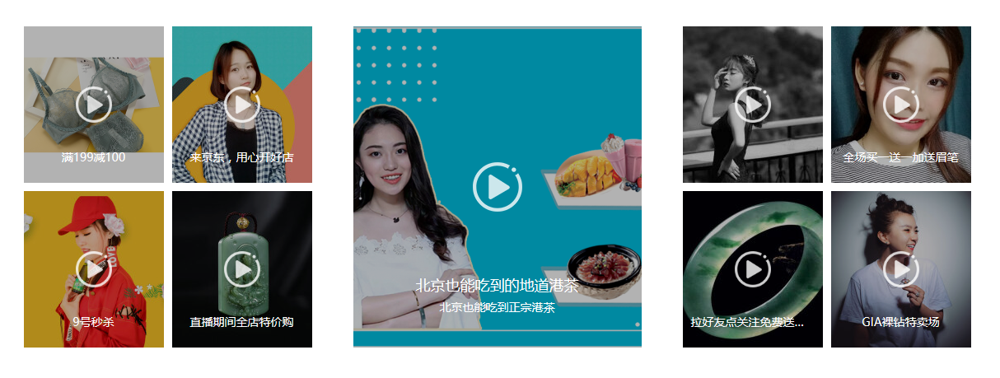

# 知识点

符合选择器、背景样式

## 题目1（加强训练）

​		电商网站中，会将产品按照一定方式罗列在页面中，通常会一行显示多个，所以需要使用浮动来排列盒子，请使用css和html代码完成下面效果。



### 训练目标

能使用浮动排列盒子

### 训练提示

1、如何让内容整体在页面中居中？

2、如何让多个可以设置宽高的盒子在一行显示

3、如何设置标签之间的距离？

### 参考方案

使用边框设置虚线、使用外边距拉开不同行之间的上下距离

### 操作步骤

1、在页面中创建一个盒子box，其中包括三个标签，使用浮动的方式将其排列在一行显示

2、通过ps测量相应的尺寸，设置不同的宽度，其中将中间盒子设置两侧margin来拉开中间盒子与其他盒子的距离

3、左右两侧的盒子中使用ul>li>img的结构，并设置li左下或右下的外边距

### 参考答案

HTML代码

```html
<div class="box">
    <div class="left">
        
    </div>
    <div class="right">
        <div class="right_top">
            
        </div>
        <ul class="right_bottom">
            <li></li>
            <li></li>
            <li></li>
            <li></li>
        </ul>
    </div>
</div>
```

CSS代码

~~~css
* {
    margin: 0;
    padding: 0;
}

li {
    list-style: none;
}

.box {
    width: 1200px;
    height: 400px;
    margin: 100px auto;
}

.box img {
    display: block;
}

.box>div {
    float: left;
}

.left {
    float: left;
    width: 228px;
    height: 400px;
}

.right {
    width: 972px;
    height: 400px;
}

.right_top {
    margin-left: 15px;
}

.right_bottom li {
    float: left;
    margin-top: 23px;
    margin-left: 16px;
}
~~~


## 题目2（综合案例）

​		在电商网站中，通常有楼层区域，每一楼层中包含左侧的提示内容或者导航栏，右侧顶部包含宣传图片或内容，右侧下部包含主要展示的商品信息。如下图所示：


### 训练目标

能够使用ps精细测量设计图，能够使用浮动和外边距来排列盒子

### 训练提示

1、空白处应该给哪个盒子设置外边距？

2、如何让内容页面水平居中？

### 参考方案

使用浮动来排列盒子

### 操作步骤

1、创建div.box，设置margin:0 auto；让盒子在页面中水平居中

2、div.box中分为左侧div.left和右侧div.right

3、div.right中分为上侧div.right_top和下侧div.right_bottom

4、在div.right_bottom中使用ul>li>img的结构引入图片

5、给div.right_top设置左外边距，给div.right_bottom中的li设置左侧外边距和上侧外边距

### 参考答案

HTML代码

```html
<div class="box">
  <a href="#">小米商城</a>
  <a href="#" class="line">|</a>
  <a href="#">MIUI</a>
  <a href="#" class="line">|</a>
  <a href="#">IoT</a>
  <a href="#" class="line">|</a>
  <a href="#">云服务</a>
  <a href="#" class="line">|</a>
  <a href="#">金融</a>
  <a href="#" class="line">|</a>
  <a href="#">有品</a>
  <a href="#" class="line">|</a>
  <a href="#">小爱开放平台</a>
  <a href="#" class="line">|</a>
  <a href="#">企业团购</a>
  <a href="#" class="line">|</a>
  <a href="#">资质证照</a>
  <a href="#" class="line">|</a>
  <a href="#">协议规则</a>
  <a href="#" class="line">|</a>
  <a href="#">下载app</a>
  <a href="#" class="line">|</a>
  <a href="#">小米商城APP</a>
  <a href="#" class="line">|</a>
  <a href="#">Select Location</a>
  <a href="#" class="line">|</a>
</div>
```

CSS代码

```css
* {
  margin: 0;
  padding: 0;
}
.box {
  height: 40px;
  background-color: #333333;
  padding-left: 60px;
}
.box a {
  display: inline-block;
  text-decoration: none;
  color: #b0b0b0;
  font-size: 12px;
  line-height: 40px;
}
.box a.line {
  color: #423c37;
  margin: 0 8px;
}
```

