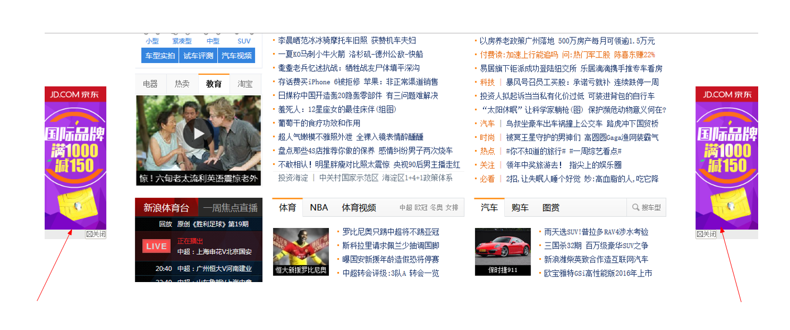
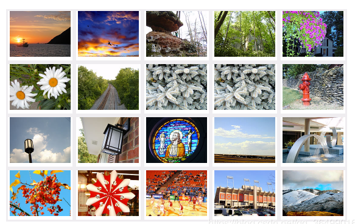
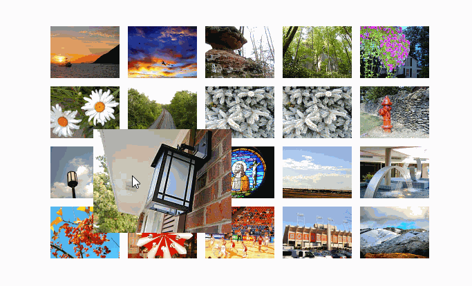

# 每日作业 - css第六天

## 1、第一题，简答题

从定位的参照物以及是否占位置，总结一下，相对定位，绝对定位和固定定位的区别


## 2、第二题：案例练习

**需求：新浪网页两侧固定的广告**



#### 新浪案例分析


1. 左右两侧的广告图片**固定**在浏览器可视窗口的左右两侧，不会随窗口一起滚动，并且要贴着版心的边缘；

   

```html
<!DOCTYPE html>
<html lang="en">
<head>
	<meta charset="UTF-8">
	<title>Document</title>
	<style>
		* {
			margin: 0;
			padding: 0;
		}
		
		.box {
			width: 1002px;
			margin: 0 auto;
		}
		
		.ad-l {
			position: fixed;
			top: 200px;
			left: 50%;
			/*1002/2  版心的一半 + 120px 盒子自己的宽度 + 10px的缝隙*/
			margin-left: -631px;

		}
		.ad-r {
			position: fixed;
			top: 200px;
			right: 50%;
			margin-right: -631px;
		}
		
	</style>
</head>
<body>
	<div class="box">
		
	</div>
	
	<!-- 左右的固定定位 -->
	
	
</body>
</html>
```


## 3、第三题：案例练习

### 需求描述：

​	定位实现鼠标滑过图片等比例放大，显示在原尺寸图片的上方。

### 起始状态



### 实现状态

