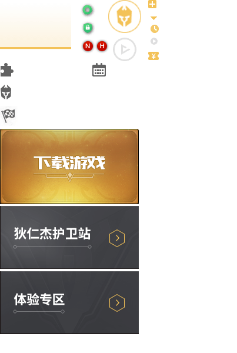

# 每日作业 - css第七天

## 1、第一题，简答题

总结今天总结的css初始化的代码，这些是写页面都需要使用的。

这些代码不需要我们背，我们只需要知道这些代码是什么意思。（熟悉）


## 2、第二题：案例练习

**需求**：购物车和登录图标切换，（**精灵图的使用**）


#### 新浪案例分析

1. 页面加载，显示的是购物车的图片，当页面加载的时候，显示“登陆”，
2. 注意：这里使用的同一张背景图；


**代码参考**

```html
<!DOCTYPE html>
<html lang="en">
<head>
	<meta charset="UTF-8">
	<title>Document</title>
	<style>
	a {
		/*转换*/
		display: inline-block;  
		width: 67px;
		/* a标签的高度，设置为背景图片的一半 */
		height: 32px;
		/*背景图片 默认左上角对齐*/
		background: url(images/car.png) no-repeat left top;
	}
	/* 当鼠标进过时，改变背景图片的定位，水平居左，垂直居底部*/
	a:hover {
		background-position: left bottom;   	
	}
	</style>
</head>
<body>
	<a href="#"></a>
</body>
</html>

```


## 3、第三题：案例练习

### 需求描述

​	如下图,王者荣耀官网的一张精灵图:



### 案例效果


### 代码参考

```html
<!DOCTYPE html>
<html lang="en">
<head>
	<meta charset="UTF-8">
	<title>Document</title>
	<style>
		/*利用精灵图就是用背景图定位,注意点:1.坐标是从左上角出发 2.背景图往反方向移动,所以是负值*/
		.hong {
			padding-left: 30px;
			/* 红旗背景图定位 */
			background: url(images/sprites.png) no-repeat -2px -185px;
		}
		.xin {
			padding-left: 240px;
			border: 1px solid #000;
			width: 500px;
			height: 108px;
			line-height: 106px;
			/* 新人专区背景图定位 */
			background: url(images/sprites.png) no-repeat -2px -349px;
		}
	</style>
</head>
<body>
	<div class="hong">精灵图的本质是处理网页背景图像的一种技术</div>
    <div class="xin">可以有效减少服务器接受和请求的次数，提高页面的加载速度</div>
</body>
</html>

```

