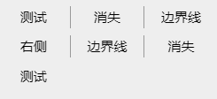
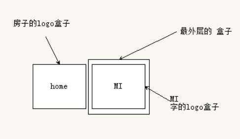
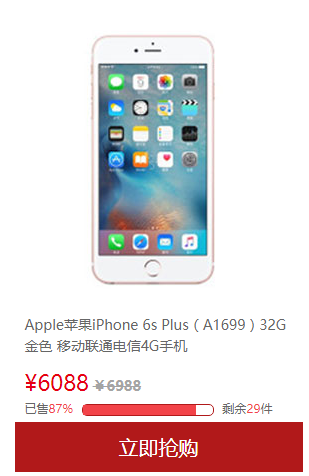
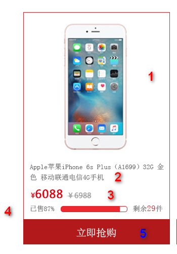
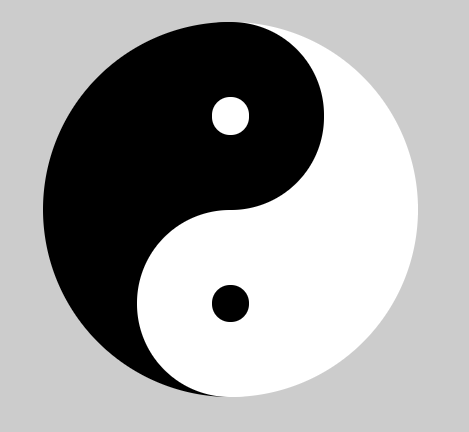
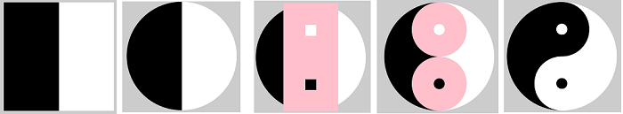

# 每日作业-前端基础Day10

作业说明：

1. 作业题分为两大部分：基础案例和扩展案例。基础案例为涵盖今日所学知识点的案例，所有学员必须全部完成，不能当日完成的利用自习课时间继续完成。扩展案例为在今日所学知识点的基础上，进行扩展训练，学有余力的同学可以尝试完成，不做强制要求。
2. 每个作业题包含训练描述、训练提示、操作步骤三项。
   - **训练描述**可理解为作业题干，有清晰的要求描述。如果读完训练描述即知道如何操作，后面两项忽略。
   - **训练提示**提供实现思路。如果读完训练描述，不能完成操作，继续查看训练提示。
   - **操作步骤**提供具体详细的实现步骤和代码。如果读完训练提示仍然不会，继续查看操作步骤。

## 基础案例

### 01-消失的边界线

#### 训练描述



看看上图，经常会在一些导航栏中见到，要求每行中最后一列的右边框消失，如何在所有浏览器中最便捷优雅的实现，当我们学习了C3的选择器，我们就能够实现

#### 训练提示

1. 创建相应的文件
2. 定义布局
   - `ul` 里面 包含了 7个 li
   - 给 `ul` 设置宽度， li 设置宽度，让li进行浮动
   - 利用 nth-child(n) 选择器来进行实现

#### 训练步骤

1. 布局比较简单，利用div盒子来包裹 `ul`，`ul`里面包裹li

   ```html
   <div class="ul-container">
       <ul>
           <li>测试</li>
           <li>消失</li>
           <li>边界线</li>
           <li>右侧</li>
           <li>边界线</li>
           <li>消失</li>
           <li>测试</li>
       </ul>
   </div>
   ```

2. 给 `ul` 设置相应样式

   - 去掉li的默认圆点
   - 给定宽度
   - 去除 `ul` 默认的内边距

   ```css
   ul {
       width: 300px;
       list-style: none;
       padding: 0;
   }
   ```

3. 给所有的li设置默认的样式

   - 设置浮动
   - 设置宽度
   - 让文字 垂直水平居中
   - 设置有边框
   - 设置文字大小

   ```css
   li {
       float: left;
       width: 99px;
       /* 下面两个属性 文字垂直方向和水平方向居中 */
       line-height: 30px;
       text-align: center;
       /* 设置右边框 */
       border-right: 1px solid #999;
       font-size: 18px;
       margin-bottom: 10px;
   }
   ```

4. 让最大的盒子居中显示，注意：里面li浮动了，需要去清除浮动

   - 设置宽度
   - 设置 margin： 0 auto  让盒子水平居中
   - 设置背景颜色
   - 利用 overflow 清除浮动

   ```css
   .ul-container {
       /*下面两个属性 让块级盒子水平居中 */
       width: 300px;
       margin: 50px auto;
       background: #eee;
       /* 里面孩子浮动了，清除浮动 */
       overflow: hidden;
   }
   ```

5. 把3的倍数的li选择出来，去除右边框

   ```css
   /* 让3的倍数的li 去掉有边框 */
   ul>li:nth-child(3n) {
       border-right: none;
   }
   ```

### 02-仿小米logo

#### 训练描述


当鼠标移入到logo上的时候，左侧会滑出一个小房子，当鼠标移出logo的时候，恢复成原来的样子，并且中间的切换是有动画的

#### 训练提示



1. 搭建以项目为主的几个文件
2. 书写 logo的页面布局
   - logo图标的布局应该是一个div的大盒子，里面包裹了a标签
   - 给a标签设置 官网名字，但是不能展示在页面显示（目的是方便搜索引擎）
   - 给a标签设置before和after两个伪元素，分别设置不同的背景图片
   - 利用偏移让两个盒子水平排列，让有home房子图片的盒子先移出整个大盒子
3. 给a标签设置hover事件，移动两个盒子（并且要有动画）

#### 操作步骤

1. 正常开发中，我们制定logo的时候，首先会先用一个div的大盒子来包裹，然后再div大盒子中放一个a标签的小盒子（目的在于logo是可以被点击的）
2. 在a标签中要写上 官网的名字，但是这个名字不是给用户看的，是为了更好的被搜索引擎搜索到，所以我们会把这个文字进行隐藏
3. 利用今天所学习到的伪元素，给这个a标签设置 before 和after 两个伪元素，分别给这两个伪元素设置背景图片

```html
<body>
    <div class="header-logo">
        <a href="" class="logo" title="小米官网">小米官网</a>
    </div>
</body>
```

4. 给最大的盒子 header-logo 设置相对定位

   ```css
   .header-logo {
       position: relative;
   }
   ```

5. 给这个 a 标签设置样式， 类名为logo

   - 更改显示模式，这是宽高为 55px，设置溢出隐藏，设置背景颜色（#ff6700），隐藏文字（text-indent: -9999em）

   ```css
   .logo {
       display: block;
       width: 55px;
       height: 55px;
       overflow: hidden;
       background-color: #ff6700;
       text-align: left;
       text-indent: -9999em;
   }
   ```

6. 给 a 标签设置 before伪元素

   - 设置绝对定位，左上角对齐，宽高为 55px，设置背景图片，设置过渡动画，opacity 透明度为1

   ```css
   /* mi logo的样式 */
   .logo::before {
       /* 定位 */
       position: absolute;
       /* 伪元素必须要设置content属性 */
       content: '';
       /* 左偏移 */
       left: 0;
       /* 上偏移 */
       top: 0;
       width: 55px;
       height: 55px;
       /* 设置过渡 */
       transition: all .3s;
       /* 背景图片 */
       background: url(./images/mi-logo.png) no-repeat center center;
       /* 透明度 */
       opacity: 1;
   }
   ```

7. 给a 标签设置 after 伪元素

   - 设置绝对定位，左上角对齐，宽高为 55px，设置背景图片，设置过渡动画，设置margin-left: -55px（刚开始让这个盒子移出整个大盒子，等鼠标移入的时候，可以滑动进来），opacity透明度为0

   ```css
   /* mi home 的样式 */
   .logo::after {
       position: absolute;
       content: '';
       left: 0;
       top: 0;
       width: 55px;
       height: 55px;
       transition: all .3s;
       background: url(./images/mi-home.png) no-repeat center center;
       margin-left: -55px;
       opacity: 0;
   }
   ```

8. 给最大的盒子设置鼠标移入事件
   - 当鼠标移入的时候，before盒子应该往右边进行偏移，偏移出整个大盒子，设置margin-left 为正值
   - 当鼠标移入的时候，after盒子应该往右边进行偏移，偏移到大盒子的中心，设置margin-left: 0;
   - 同时修改一下透明度
   - 当鼠标移出的时候，两个伪元素的盒子会恢复初始的状态，然后我们在两个伪元素盒子里面设置了过渡，所以它们就会以动画的形式恢复到初始位置

   ```css
    /* 鼠标移入 让mi logo 往右侧进行滑动 */
   .logo:hover::before {
       opacity: 0;
       margin-left: 55px;
   }
   /* 鼠标移入 让mi home 回到盒子中间 */
   
   .logo:hover::after {
       opacity: 1;
       margin-left: 0;
   }
   ```

### 03-商品列表

#### 训练描述



京东商品列表页面 单个列表项的制作，在这里结合了之前学习的知识点，是个比较综合的案例，通过这个案例的练习，让大家更加的熟悉页面的布局

#### 训练提示



1. 搭建以项目为准的几个文件
2. 开始页面的布局
   - 利用  `ul` 包裹 `li` 搭建最大的盒子
   - li 里面分为上下结构，图片，文字，价格，进度条，立即抢购的a标签（在这里文字不要纠结用什么标签，只要是能放文本标签的都是可以的，但是要注意，先要确定大盒子的位置，也就是我上面标志的 1 2 3 4 5，然后再布局里面的内容）
   - 先把布局布局好，布局好了，样式都好调整，布局不对，样式会很复杂
   - 注意一下进度条的布局，利用今天所学的知识点
   - 最下面a标签要设置宽高，但是a是行内元素，默认不能设置宽高
   - 在一段文字中，有几个文字边了颜色（剩余29件，这个29就是红色），一旦遇到这种情况，变色的文字必然被一个标签包裹起来了，然后单独设置样式

#### 操作步骤

1. 按照正常开发的思路来进行布局，这个属于是商品列表的效果，那么商品肯定不只一个，所以这个大盒子的布局我们要用`ul` 来 包裹 `li`

2. 给li 取类名 叫做 `goods` 

   ```html
   <ul>
       <li class="goods">
          ...
       </li>
   </ul>
   ```

3. 里面的内容按照上面的结构划分

4. 1 号盒子 放一个 `img` 图片

   ```html
   <ul>
       <li class="goods">
          
          ...
       </li>
   </ul>
   ```

5. 2 号盒子 我们可以放一个 `h5` 的标签，取名为 `goods_title`

   ```html
   <ul>
       <li class="goods">
          
          <h5 class="goods_title">Apple苹果iPhone 6s Plus（A1699）32G 金色 移动联通电信4G手机</h5>
          ...
       </li>
   </ul>
   ```

6. 3 号盒子 我们放一个 `p` 标签，取名为 `goods_price`

   - 3号 盒子里面 左侧放 一个 `em` 标签，来包裹 抢购价格
   - 3号 盒子里面 右侧放一个 `del` 标签，来包裹 划掉的价格

   ```html
   <ul>
       <li class="goods">
          
          <h5 class="goods_title">Apple苹果iPhone 6s Plus（A1699）32G 金色 移动联通电信4G手机</h5>
          <p class="goods_price"><em>¥6088</em> <del>￥6988</del></p>
          ...
       </li>
   </ul>
   ```

7. 4 号盒子 我们放一个 div 标签，取名为 goods_progress

   - 4号 盒子里面 分为  左 中 右 的布局思路
   - 左侧放 `i` 标签 来包裹  已售 87%
   - 中间是进度条的布局，可以利用今天所学习的知识点来进行布局， 一个外层的`div` 盒子 里面包裹里层的`div`盒子，给外层的div盒子取名为  `bar`，给里层的div盒子取名 `bar_in`
   - 右侧放 `em` 标签， 来包裹，剩余29件文字中的29数字

   ```html
   <ul>
       <li class="goods">
          
          <h5 class="goods_title">Apple苹果iPhone 6s Plus（A1699）32G 金色 移动联通电信4G手机</h5>
          <p class="goods_price"><em>¥6088</em> <del>￥6988</del></p>
          <div class="goods_progress">
              已售<i>87%</i>
              <div class="bar">
                  <div class="bar_in"></div>
              </div>
              剩余<em>29</em>件
          </div>
          ...
       </li>
   </ul>
   ```

8. 5 号盒子 我们放一个 a 标签即可，取名 `goods_buy`

   ```html
   <ul>
       <li class="goods">
          
          <h5 class="goods_title">Apple苹果iPhone 6s Plus（A1699）32G 金色 移动联通电信4G手机</h5>
          <p class="goods_price"><em>¥6088</em> <del>￥6988</del></p>
          <div class="goods_progress">
              已售<i>87%</i>
              <div class="bar">
                  <div class="bar_in"></div>
              </div>
              剩余<em>29</em>件
          </div>
          <a href="#" class="goods_buy">立即抢购</a>
       </li>
   </ul>
   ```

9. 设置一些基本样式

   - 给`body` 设置 字体相关样式，以及背景颜色
   - 去掉 `li` 的默认小黑点
   - 让斜体不倾斜
   - 取消a`标签下划线`
   - 去除 元素默认的 内外边距

   ```css
   body {
       background-color: #fff;
       font: 12px/1.5 'Microsoft YaHei', 'Heiti SC', tahoma, arial, 'Hiragino Sans GB', \\5B8B\4F53, sans-serif;
       color: #666;
   }
   /* 取出盒子的默认内外边距 */
   
   * {
       margin: 0;
       padding: 0;
   }
   
   ul {
       /* 取消无序列表前面小圆点 */
       list-style: none;
   }
   /* 取消a标签下划线 */
   
   a {
       text-decoration: none;
   }
   /* 让斜体不倾斜 */
   
   em {
       font-style: normal;
   }
   ```

10. 给li标签设置相应样式， li标签取名为 goods，所以我们可以通过类选择器来实现

   - 设置浮动为左浮动
   - 设置 宽度为 `288px` 
   - 设置 高度为 `458px`
   - 设置相对定位，方便下面 立即抢购的 a 盒子进行定位

   ```css
   .goods {
       position: relative;
       float: left;
       width: 288px;
       height: 458px;
   }
   ```

11. 给 2 号盒子 h5 标题，来设置样式，标题 取名为 `goods_title`

    - 设置文字大小 `14px` 
    - 设置字体颜色 `#666`
    - 设置取消字体加粗
    - 设置`padding 10px`  让上下左右有些空白间隙会比较好看

    ```css
     .goods_title {
        font-size: 14px;
        color: #666;
        font-weight: normal;
        padding: 10px;
    }
    ```

12. 给 3 号盒子 价格这一行设置相应样式，3号 盒子 取名为 `goods_price`

    - 给3号盒子设置左右 10像素的padding值，让两侧有些间隙
    - 给左侧的 价格设置 文字大小 `22px`，颜色为红色（#e60012）
    - 给右侧的 价格设置 文字大小 `14px`，加粗，颜色为灰色（#a4a4a4）

    ```css
    /* 3号盒子价格样式 */
     .goods_price {
         padding: 0 10px;
     }
     /* 3号盒子里面 左侧价格样式 */
     
     .goods_price em {
         font-size: 22px;
         color: #e60012;
     }
     /* 3号盒子里面 右侧价格样式 */
     
     .goods_price del {
         font-size: 14px;
         font-weight: 700;
         color: #a4a4a4;
     }
    ```

13. 给4号盒子设置样式，4号盒子 取名为 `goods_progress`

    - 给4号盒子设置左右 10像素的padding值，让两侧有些间隙
    - 给中间进度条 外层的`div`盒子设置样式，外层取名为 `bar`；设置 display为行内块，设置宽度 `130px`，设置高度 10px，设置1个像素的边框，设置5个像素的圆角边框，设置左右5px的margin值来让两边有些间隙
    - 给中间进度条 内层的div盒子设置样式，内层取名为 bar_in，设置宽度为87%，高度是10px，设置背景颜色（#f24349）
    - 修改一下4号盒子里面的文字颜色

    ```css
    /* 4号盒子样式 */
    .goods_progress {
        padding: 0 10px;
    }
    /* 4号盒子中间进度条外层盒子样式 */
    
    .bar {
        display: inline-block;
        width: 130px;
        height: 10px;
        border: 1px solid #b1191a;
        vertical-align: middle;
        margin: 0 5px;
        border-radius: 5px;
    }
    /* 4号盒子中间进度条内层盒子样式 */
    
    .bar_in {
        width: 87%;
        height: 10px;
        background-color: #f24349;
    }
    /* 设置4号盒子里面文字颜色 */
    
    .goods_progress em,
    .goods_progress i {
        color: #f24349;
    }
    ```

14. 给5号盒子设置样式，5号盒子 取名为 `goods_buy`

    - 固定在底层，利用定位会比较方便
    - 设置绝对定位，bottom为0，宽度是父亲的宽度，设置高度为 `50px`，设置背景颜色（#b1191a），文字颜色为白色，文字居中显示，字体大小为 `20px`

    ```css
    /* 5号盒子 a 标签的样式 */
    .goods_buy {
        position: absolute;
        bottom: 0;
        width: 100%;
        height: 50px;
        background-color: #b1191a;
        color: #fff;
        text-align: center;
        line-height: 50px;
        font-size: 20px;
    }
    ```


## 拓展案例

### 太极图

#### 训练描述



熟悉伪元素选择器的使用，只用一个div的盒子来完成这个效果

#### 训练提示

1. 创建好项目对应的文件‘
2. 开始结构布局
   - 布局里面只有一个div的盒子
   - div盒子设置白色背景，左边框设置黑色背景
   - 给这个div盒子设置 before 和 after 伪元素，一个放在盒子中心的上方，一个放在盒子中心的下方
   - 设置 伪元素的宽高，边框宽度和颜色， 然后给  div 盒子 和伪元素盒子设置  圆角边框



#### 训练步骤

1. 创建一个 div 的盒子 

   ```html
   <body>
       <div></div>
   </body>
   ```

2. 给这个div盒子设置相应样式

   - 设置盒子的宽高，左边框， 由于太极图是一个圆形， 所以 宽高要相等（盒子的高度 = 盒子的宽度 + 左边框的宽度）
   - 给盒子设置相对定位（后续两个伪元素需要定位的方式放在相应位置）
   - 设置背景颜色和左边框的颜色（一个白色，一个黑色）
   - 设置圆角边框

   ```css
    div {
        position: relative;
        width: 150px;
        height: 300px;
        background-color: #fff;
        border-left: 150px solid #000;
        margin: 100px auto;
        border-radius: 50%;
    }
   ```

3. 给div 盒子设置 before伪元素

   - 给伪元素设置绝对定位， before伪元素要设置为 上面的圆环，所以 top 设置为0，left 需要往左边偏移自身宽度的一半
   - 给伪元素设置 宽高， 边框
   - 给伪元素设置背景颜色，伪元素的背景颜色要跟边框的颜色相反，如图所示，上面的圆环是黑色的，那么中心的小点就是白色的，而这个黑色就是边框来实现的，白色的就是伪元素自身的背景颜色
   - 设置圆角边框

   ```css
   div::before {
       position: absolute;
       height: 30px;
       width: 30px;
       border: 60px solid #000;
       background-color: #fff;
       content: '';
       left: -75px;
       border-radius: 50%;
   }
   ```

4. 给div盒子设置 after 伪元素

   - 给伪元素设置绝对定位， after 伪元素要设置为 下面的圆环，所以 top 设置为0，left 需要往左边偏移自身宽度的一半
   - 给伪元素设置 宽高， 边框
   - 给伪元素设置背景颜色，伪元素的背景颜色要跟边框的颜色相反，如图所示，下面的圆环是白色的，那么中心的小点就是黑色的，而这个白色就是边框来实现的，黑色的就是伪元素自身的背景颜色
   - 设置圆角边框

   ```css
   div::after {
       position: absolute;
       height: 30px;
       width: 30px;
       background-color: #000;
       border: 60px solid #fff;
       content: '';
       left: -75px;
       bottom: 0px;
       border-radius: 50%;
   }
   ```

   