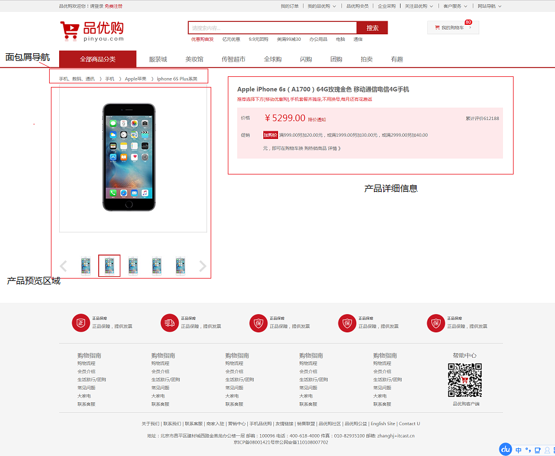
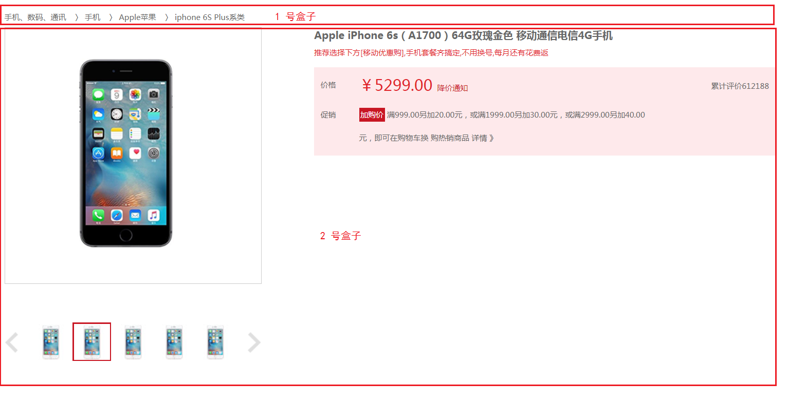
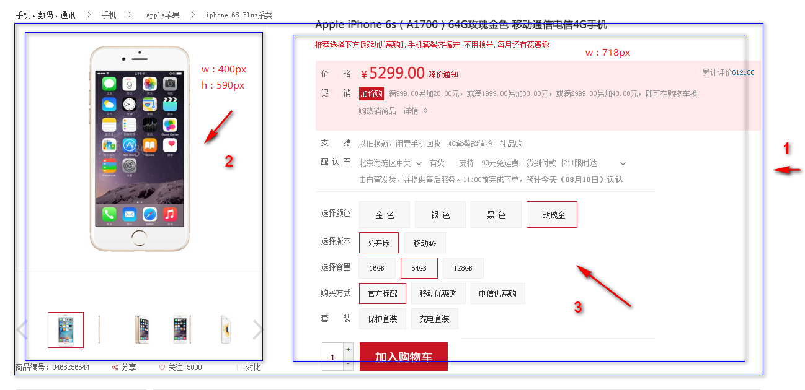
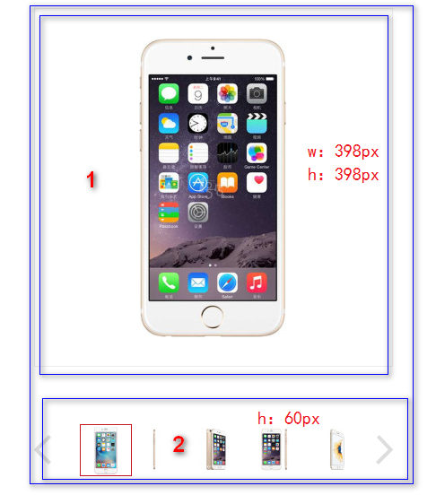
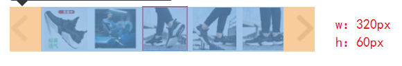
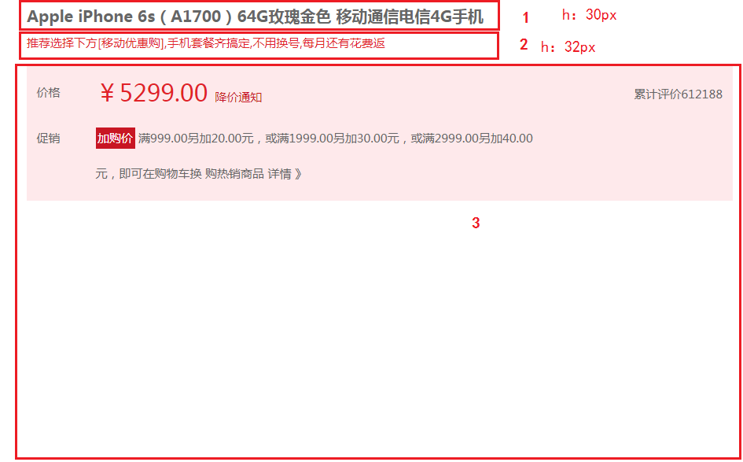

# 每日作业-品优购项目Day01

作业说明：

1. 作业题分为两大部分：基础案例和扩展案例。基础案例为涵盖今日所学知识点的案例，所有学员必须全部完成，不能当日完成的利用自习课时间继续完成。扩展案例为在今日所学知识点的基础上，进行扩展训练，学有余力的同学可以尝试完成，不做强制要求。
2. 每个作业题包含训练描述、训练提示、操作步骤三项。
   - **训练描述**可理解为作业题干，有清晰的要求描述。如果读完训练描述即知道如何操作，后面两项忽略。
   - **训练提示**提供实现思路。如果读完训练描述，不能完成操作，继续查看训练提示。
   - **操作步骤**提供具体详细的实现步骤和代码。如果读完训练提示仍然不会，继续查看操作步骤。

## 拓展案例

### 品优购详情页面

#### 训练描述



对整个基础班学习内容再进行一次的巩固，熟练使用PC端的布局，与我们课程可以良好的衔接；整个详情页面分两天来完成，今天完成到 促销这个小模块；今天作业包含以下模块：

- 复制我们写好的 header 部分  和 footer 部分
- 完成面包屑导航
- 完成产品的预览区域
- 完成产品详细信息区域

#### 训练提示

**详情页常用的单词**

| 名称             | 说明                                  |
| ---------------- | ------------------------------------- |
| 主体             | de_container                          |
| 面包屑导航       | crumb_wrap                            |
| 产品介绍         | product_intro   （ introduction介绍） |
| 预览包           | preview_wrap（左侧部分）              |
| 预览缩略图       | preview_img                           |
| 预览列表         | preview_list                          |
| 左按钮           | arrow_prev                            |
| 右按钮           | arrow_next                            |
| 小图列表         | preview_items                         |
| 产品详细信息区域 | itemInfo_wrap （右侧部分）            |
| 头部名称         | sku_name       skull  头骨            |
| 新闻             | news                                  |
| 摘要             | summary                               |
| 评价             | remark                                |
| 价格摘要         | summary_price                         |
| 配送至           | summary_stock                         |
| 支持             | summary_support                       |
| 选择             | choose                                |
| 选择按钮组       | choose_btns                           |
| 选择数量         | choose_amount                         |
| 减去             | reduce                                |
| 加入购物车       | addshopcar                            |
| 产品细节         | product_detail      （   detail描述） |
| 左侧边           | aside                                 |
| 详细描述         | detail                                |

1. 创建好项目需要的文件和文件夹
2. 按照从上至下，从左至右的思路来分析页面布局
3. 内容区域先分为 上下两个盒子，上面放面包屑导航，下面放 预览区域的盒子 和 产品介绍的盒子
4. 预览区域的盒子 和 产品介绍信息的盒子分为 左右 结构 
5. 填充里面的内容
   - 预览区域的左右箭头 用定位的方式来实现
   - 产品详细信息的累积评价 用定位的方式来实现

#### 训练步骤

1. 拷贝好之前写的 `header` 区域和  `footer` 区域

   - 把 之前写好的 `header` 结构 和 `footer` 结构拷贝进来
   - 拷贝 `base.css` 文件  和 `common.css` 文件到项目的 `css`目录下

2. 首先有个最大的盒子来包裹，取名为 de_container，给这个盒子设置版心，让内容能够居中显示，然后把内容区域分为上下结构，如下图

   

   - 给这个大盒子设置 `20px` 的上外边距，这样让内容距离 `header` 有一定的间隙

   **结构代码**

   ```html
   <!-- 详情页内容部分	 -->
   <div class="de_container w">
       <!-- 面包屑导航 -->
       <div class="crumb_wrap">
           ...
       </div>
       <!-- 产品介绍模块 -->
       <div class="product_intro clearfix">
          ...
       </div>
   </div>
   ```

   **样式代码**

   ```css
   .de_container {
   	margin-top: 20px;
   }
   ```

3. 1 号盒子里面放**面包屑**导航

4. 2 号盒子里面放 **预览区域盒子**  和 **产品介绍的盒子**

5. 分好结构了之后，先来完成 **面包屑** 导航

   

   - crumb_wrap   面包屑导航
   - 关于面包屑导航的由来是源于一则童话故事的一个词语：汉泽尔和格蕾特尔两个人在穿过森林是，为了避免找不到回家的路，他们在沿途走过的地方都会撒下面包屑以便于根据这些面包屑找到回家的路。
   - 里面布局比较简单，直接包裹 a 标签即可
   - 给 crumb_wrap 设置

   **结构代码**

   ```html
   <!-- 面包屑导航 -->
   <div class="crumb_wrap">
       <a href="#">手机、数码、通讯</a> 〉 <a href="#">手机   </a> 〉 <a href="#">Apple苹果   </a> 〉 <a href="#">iphone 6S Plus系类</a>
   </div>
   ```

   **样式代码**

   ```css
   .crumb_wrap {
   	height: 25px;
   }
   .crumb_wrap a {
   	margin-right: 10px;
   }
   ```

6. 下面来完成 **产品介绍内容的布局**

   

   - 1号盒子 本模块 命名为产品模块   `product_intro`   （ introduction介绍）
   - 此模块不要给高度  因为右侧的模块内容高度不固定
   - 里面有2个盒子  分为是2号盒子 和  3号盒子  
   - 2号盒子为  预览区域  `preview_wrap`   给宽度，给高度， 左浮动
   - 3号盒子为  产品详细信息区域  `itemInfo_wrap` 给宽度 ，不要给高度  左侧浮动 

   **结构代码**

   ```html
   <!-- 产品介绍模块 -->
   <div class="product_intro clearfix">
       <!-- 预览区域 -->
       <div class="preview_wrap fl">
           ...
       </div>
       <!-- 产品详细信息 -->
       <div class="itemInfo_wrap fr">
           ...
       </div>
   </div>
   ```

   **样式代码**

   ```css
   .preview_wrap {
   	width: 400px;
   	height: 590px;
   }
   .itemInfo_wrap {
   	width: 718px;
   }
   ```

7. 产品模块两侧布局好了之后，接下来先来完成 左侧 预览区域的 内容布局

   

   - 1号盒子 为  图片预览   命名为   `preview_img`    注意里面的图片，我们切图的时候是 398*398 像素的

   - 2号盒子 为 预览列表   命名为  `preview_list`

     

     - 盒子 有左右按钮   `arrow_prev`   `arrow_next`  用定位即可 
     - 中间 用 `ul`  命名为    `list`-item    给宽度和高度 然后  `margin: 0 auto`;  水平居中对齐即可

   **结构代码**

   ```html
   <!-- 预览区域 -->
   <div class="preview_wrap fl">
       <div class="preview_img">
           
       </div>
   
       <div class="preview_list">
           <a href="#" class="arrow_prev"></a>
           <a href="#" class="arrow_next"></a>
           <ul class="list_item">
               <li>
                   
               </li>
               <li class="current">
                   
               </li>
               <li>
                   
               </li>
               <li>
                   
               </li>
               <li>
                   
               </li>
           </ul>
       </div>
   </div>
   ```

   **样式代码**

   ```css
   .preview_list {
   	position: relative;
   	height: 60px;
   	margin-top: 60px;
   }
   .list_item {
   	width: 320px;
   	height: 60px;
   	margin: 0 auto;
   }
   .list_item li {
   	float: left;
   	width: 56px;
   	height: 56px;
   	border: 2px solid transparent;
   	margin: 0 2px;
   }
   .list_item li.current {
   	border-color: #c81623;
   }
   .arrow_prev,
   .arrow_next {
   	position: absolute;
   	top: 15px;
   	width: 22px;
   	height: 32px;
   	background-color: purple;
   }
   .arrow_prev {
   	left: 0;
   	background: url(../img/arrow-prev.png) no-repeat;
   }
   .arrow_next {
   	right: 0;
   	background: url(../img/arrow-next.png) no-repeat;
   }
   ```

8. 接下来来完成 产品详细模块的制作  `itemInfo_wrap`

   

   - 此盒子命名为 `itemInfo`

   - 1 号盒子 为 头部 `sku_name`    

   - 2 号盒子 为 最新新闻  `news`  

   - 3号盒子 为  产品详细摘要  我们命名为  `summary` （摘要的意思）   之所以下面都是摘要部分，因为里面格式基本相同

     - 里面的布局，每一行用自定义列表来实现（`dl > dt + dd`）
     - 给 `dt` 和 `dd` 设置浮动，设置 `dt` 高度为 60px

     - 里面的 累积评价  用定位的方式定在右侧

   **结构代码**

   ```html
   <div class="itemInfo_wrap fr">
       <div class="sku_name">
           Apple iPhone 6s（A1700）64G玫瑰金色 移动通信电信4G手机
       </div>
       <div class="news">
           推荐选择下方[移动优惠购],手机套餐齐搞定,不用换号,每月还有花费返
       </div>
       <div class="summary">
           <dl class="summary_price">
               <dt>价格</dt>
               <dd>
                   <i class="price">￥5299.00 </i>
   
                   <a href="#">降价通知</a>
   
                   <div class="remark">累计评价612188</div>
   
               </dd>
           </dl>
           <dl class="summary_promotion">
               <dt>促销</dt>
               <dd>
                   <em>加购价</em> 满999.00另加20.00元，或满1999.00另加30.00元，或满2999.00另加40.00元，即可在购物车换 购热销商品 详情 》
               </dd>
           </dl>
       </div>
   </div>
   ```

   **样式代码**

   ```css
   .itemInfo_wrap {
   	width: 718px;
   }
   .sku_name {
   	height: 30px;
   	font-size: 16px;
   	font-weight: 700;
   }
   .news {
   	height: 32px;
   	color: #e12228;
   }
   .summary dl {
   	overflow: hidden;
   }
   .summary dt,
   .summary dd {
   	float: left;
   }
   .summary dt {
   	width: 60px;
   	padding-left: 10px;
   	line-height: 36px;
   }
   .summary_price ,
   .summary_promotion {
   	position: relative;
   	padding: 10px 0;
   	background-color: #fee9eb;
   }
   ```
   **产品详细模块命名**
| 名称       | 说明                                      |
| ---------- | ----------------------------------------- |
| 头部名称   | sku_name       skull  头骨                |
| 新闻       | news                                      |
| 摘要       | summary                                   |
| 评价       | remark                                    |
| 价格摘要   | summary_price                             |
| 促销摘要   | summary_promotion                         |
| 配送至     | summary_stock                             |
| 支持       | summary_support                           |
| 选择       | choose                                    |
| 选择版本  | choose_version                 |
| 选择类型   | choose_type                       |
| 选择按钮组   | choose_btns                             |
| 选择数量   | choose_amount        add 是加的意思          |
| 减去       | reduce     cursor: not-allowed;  禁止符号 |
| 加入购物车 | addshopcar                                |

