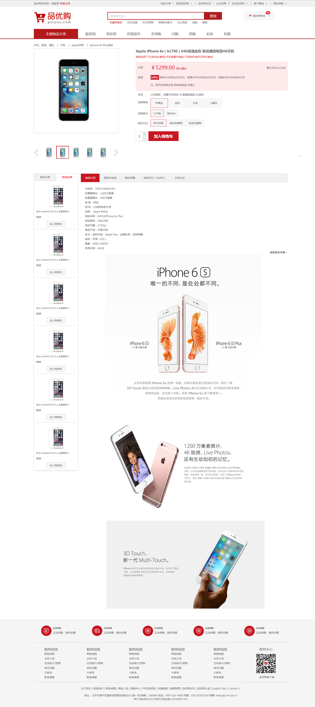
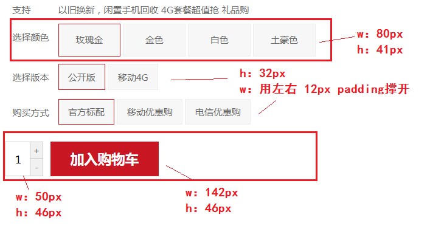
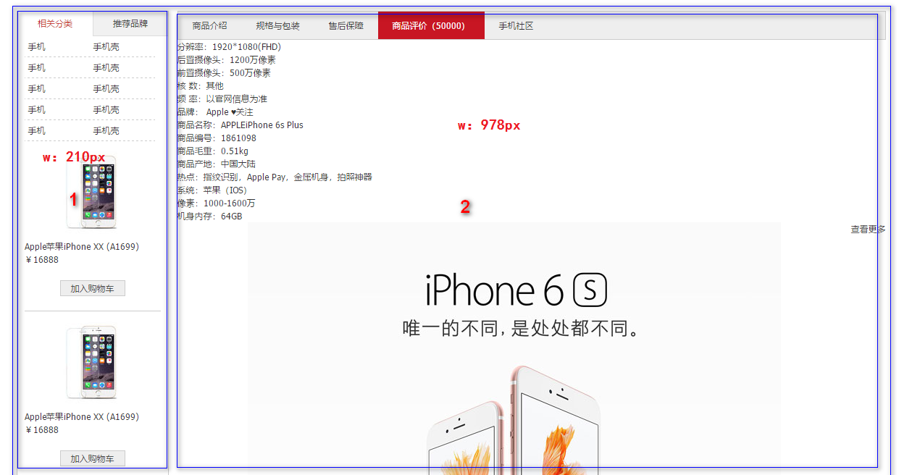
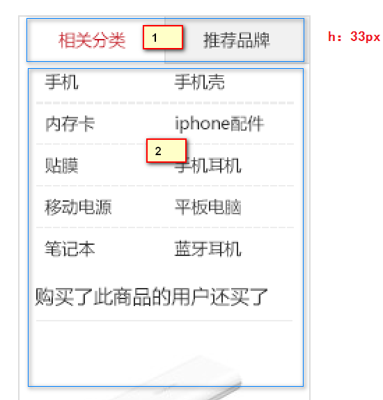
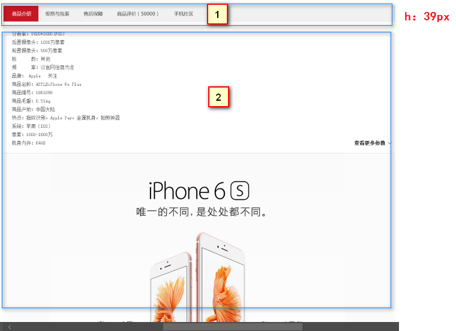

# 每日作业-品优购项目Day02

作业说明：

1. 作业题分为两大部分：基础案例和扩展案例。基础案例为涵盖今日所学知识点的案例，所有学员必须全部完成，不能当日完成的利用自习课时间继续完成。扩展案例为在今日所学知识点的基础上，进行扩展训练，学有余力的同学可以尝试完成，不做强制要求。
2. 每个作业题包含训练描述、训练提示、操作步骤三项。
   - **训练描述**可理解为作业题干，有清晰的要求描述。如果读完训练描述即知道如何操作，后面两项忽略。
   - **训练提示**提供实现思路。如果读完训练描述，不能完成操作，继续查看训练提示。
   - **操作步骤**提供具体详细的实现步骤和代码。如果读完训练提示仍然不会，继续查看操作步骤。

## 拓展案例

### 品优购详情页面

#### 训练描述



对整个基础班学习内容再进行一次的巩固，熟练使用PC端的布局，与我们课程可以良好的衔接；整个详情页面分两天来完成，今天完成到 促销这个小模块；今天作业包含以下模块：

1. 商品详细模块完成
2. 产品细节模块完成

#### 训练提示

**详情页常用的单词**

| 名称             | 说明                                  |
| ---------------- | ------------------------------------- |
| 主体             | de_container                          |
| 面包屑导航       | crumb_wrap                            |
| 产品介绍         | product_intro   （ introduction介绍） |
| 预览包           | preview_wrap（左侧部分）              |
| 预览缩略图       | preview_img                           |
| 预览列表         | preview_list                          |
| 左按钮           | arrow_prev                            |
| 右按钮           | arrow_next                            |
| 小图列表         | preview_items                         |
| 产品详细信息区域 | itemInfo_wrap （右侧部分）            |
| 头部名称         | sku_name       skull  头骨            |
| 新闻             | news                                  |
| 摘要             | summary                               |
| 评价             | remark                                |
| 价格摘要         | summary_price                         |
| 配送至           | summary_stock                         |
| 支持             | summary_support                       |
| 选择             | choose                                |
| 选择按钮组       | choose_btns                           |
| 选择数量         | choose_amount                         |
| 减去             | reduce                                |
| 加入购物车       | addshopcar                            |
| 产品细节         | product_detail      （   detail描述） |
| 左侧边           | aside                                 |
| 详细描述         | detail                                |

1. 在昨天做完的作业基础上开始继续开发
2. 利用 `dl > dt + dd` 布局的思路完成商品详细信息区域的完成
3. 产品细节模块分为左右两个盒子
   1. 两个大盒子浮动
   2. 左侧盒子里面分为上下结构，上面放tab选项卡，下面放内容（`ul > li > 内容`）
   3. 右侧盒子里面分为上下结构，上面放tab选项卡，下面放内容

#### 训练步骤



- 加入购物车上面的模块布局与之前的一致，利用 `dl > dt + dd` 的方式来布局

  - 选择颜色这一块，后面的选项是可以点击的，所以这里用 a 标签进行包裹，设置成行内块元素，设置宽高，行内块中间默认有间隙，就不用设置边距了

  **结构代码**

  ```html
  <dl class="summary_support">
      <dt>支持</dt>
      <dd>以旧换新，闲置手机回收 4G套餐超值抢 礼品购</dd>
  </dl>
  <dl class="choose_color">
      <dt>选择颜色</dt>
      <dd>
          <a href="javascript:;" class="current">玫瑰金</a>
          <a href="javascript:;">金色</a>
          <a href="javascript:;">白色</a>
          <a href="javascript:;">土豪色</a>
      </dd>
  </dl>
  <dl class="choose_version">
      <dt>选择版本</dt>
      <dd>
          <a href="javascript:;" class="current">公开版</a>
          <a href="javascript:;">移动4G</a>
      </dd>
  </dl>
  <dl class="choose_type">
      <dt>购买方式</dt>
      <dd>
          <a href="javascript:;" class="current">官方标配</a>
          <a href="javascript:;">移动优惠购</a>
          <a href="javascript:;">电信优惠购</a>
      </dd>
  </dl>
  ```

  **样式代码**

  ```css
  .summary_support dd {
  	line-height: 36px;
  }
  .choose_color a {
  	display: inline-block;
  	width: 80px;
  	height: 41px;
  	background-color: #f7f7f7;
  	border: 1px solid #ededed;
  	text-align: center;
  	line-height: 41px;
  }
  .summary a.current {
  	border-color: #c81623;
  }
  .choose_version  {
  	margin: 10px 0;
  }
  .choose_version a,
  .choose_type a {
  	display: inline-block;
  	height: 32px;
  	padding: 0 12px;
  	background-color: #f7f7f7;
  	border: 1px solid #ededed;
  	text-align: center;
  	line-height: 32px;
  }
  ```

- 最下面的布局有一些不一样，左侧里面是一个输入框然后有两个按钮，右侧放一个 a 标签即可

  - 左侧的布局思路是： 先有一个大盒子（choose_amount）来包裹 输入框 还有 按钮
  - 然后给输入框设置宽高
  - 两个按钮设置宽高，然后利用定位的方式放在相应的位置

  **结构代码**

  ```html
  <div class="choose_btns">
      <div class="choose_amount">
          <input type="text" value="1">
          <a href="javascript:;" class="add">+</a>
          <a href="javascript:;" class="reduce">-</a>
      </div>
      <a href="#" class="addcar">加入购物车</a>
  </div>
  ```

  **样式代码**

  ```css
  .choose_btns {
  	margin-top: 20px;
  }
  .choose_amount {
  	position: relative;
  	float: left;
  	width: 50px;
  	height: 46px;
  	background-color: pink;
  }
  .choose_amount input {
  	width: 33px;
  	height: 44px;
  	border: 1px solid #ccc;
  	text-align: center;
  }
  .add,
  .reduce {
  	position: absolute;
  	right: 0;
  	width: 15px;
  	height: 22px;
  	border: 1px solid #ccc;
  	background-color: #f1f1f1;
  	text-align: center;
  	line-height: 22px;
  }
  .add {
  	top: 0;
  	
  }
  .reduce {
  	bottom: 0;
  	/*禁止鼠标样式*/
  	cursor: not-allowed;   /* pointer  小手  move  移动  */
  }
  .addcar {
  	float: left;
  	width: 142px;
  	height: 46px;
  	background-color: #c81623;
  	text-align: center;
  	line-height: 46px;
  	font-size: 18px;
  	color: #fff;
  	margin-left: 10px;
  	font-weight: 700;
  }
  ```



-  大盒子 product_detail  包裹两个盒子，不要给高度 ，别忘记清除浮动

- 1 号盒子 左侧浮动 命名为 aside  有宽度 不给高度
  

  - 1 号盒子 命名为 tab_list   给高度就好了 ，里面 放 `ul` 和 `li`   注意这是 tab栏切换布局
  - 注意一下 左侧的`li` 宽度是 104px，右侧的`li`是 103px 然后加一个 1px 的左边框
  - 2 号盒子  命名为  tab_con    里面还包含 很多个`ul.item` 和 上面的 `tab_list` 里面的li一一对应
  - 在 `li` 里面的文字 是单行进行显示，如果文字过长，可能会超出盒子的宽度，所以我们需要对这个盒子设置  溢出省略号显示

  **结构代码**

  ```html
  <!-- aside -->
  <div class="aside fl">
      <div class="tab_list">
          <ul>
              <li class="first_tab ">相关分类</li>
              <li class="second_tab current">推荐品牌</li>
          </ul>
      </div>
      <div class="tab_con">
          <ul>
              <li> 
                  
                  <h5>华为 HUAWEI P20 Pro 全面屏徕卡</h5>
                  <div class="aside_price">¥19</div>
                  <a href="#" class="as_addcar">加入购物车</a>
              </li>
              <li>
                  
                  <h5>华为 HUAWEI P20 Pro 全面屏徕卡</h5>
                  <div class="aside_price">¥19</div>
                  <a href="#" class="as_addcar">加入购物车</a>
              </li>
              <li>
                  
                  <h5>华为 HUAWEI P20 Pro 全面屏徕卡</h5>
                  <div class="aside_price">¥19</div>
                  <a href="#" class="as_addcar">加入购物车</a>
              </li>
              <li>
                  
                  <h5>华为 HUAWEI P20 Pro 全面屏徕卡</h5>
                  <div class="aside_price">¥19</div>
                  <a href="#" class="as_addcar">加入购物车</a>
              </li>
              <li>
                  
                  <h5>华为 HUAWEI P20 Pro 全面屏徕卡</h5>
                  <div class="aside_price">¥19</div>
                  <a href="#" class="as_addcar">加入购物车</a>
              </li>
              <li>
                  
                  <h5>华为 HUAWEI P20 Pro 全面屏徕卡</h5>
                  <div class="aside_price">¥19</div>
                  <a href="#" class="as_addcar">加入购物车</a>
              </li>
          </ul>
      </div>
  </div>
  ```

  **样式代码**

  ```css
  .aside {
  	width: 208px;
  	border: 1px solid #ccc;
  }
  .tab_list {
  	overflow: hidden;
  	height: 34px;
  }
  /*把背景颜色 底边框都给 li*/
  .tab_list li {
  	float: left;
  	background-color: #f1f1f1;
  	border-bottom: 1px solid #ccc;
  	height: 33px;
  	text-align: center;
  	line-height: 33px;
  }
  /*鼠标单击 li 变化样式   背景变白色 去掉下边框 文字变颜色*/
  .tab_list .current {
  	background-color: #fff;
  	border-bottom: 0;
  	color: red;
  }
  .first_tab {
  	width: 104px;
  }
  .second_tab {
  	width: 103px;
  	border-left: 1px solid #ccc;
  }
  .tab_con {
  	padding: 0 10px;
  }
  .tab_con li {
  	border-bottom: 1px solid #ccc;
  }
  .tab_con li h5 {
  	/*超出的文字省略号显示*/
  	white-space: nowrap;
  	overflow: hidden;
  	text-overflow: ellipsis;
  	font-weight: 400;
  }
  .aside_price {
  	font-weight: 700;
  	margin: 10px 0;
  }
  .as_addcar {
  	display: block;
  	width: 88px;
  	height: 26px;
  	border: 1px solid #ccc;
  	background-color: #f7f7f7;
  	margin: 10px auto;
  	text-align: center;
  	line-height: 26px;
  }
  ```

- 2号盒子 右侧浮动  命名为 detail   有宽度不给高度

  

  - 1 号盒子 命名为 `detail_tab_list`   给高度就好了 ，里面 放 `ul` 和 `li`   注意这是 tab栏切换布局
  - 设置1px 的边框，选中的 `li` 设置 `current` 的类名，让背景变红，文字变白
  - 2 号盒子  命名为  `detail_tab_con`    里面还包含 很多个`ul.item` 和 上面的 `tab_list` 里面的`li`一一对应
  - 下面文字内容用 `ul > li > 文字内容`，下面的直接插入图片即可

  **结构代码**

  ```html
  <!-- detail -->
  <div class="detail fr">
      <div class="detail_tab_list">
          <ul>
              <li class="current">商品介绍</li>
              <li>规格与包装</li>
              <li>售后保障</li>
              <li>商品评价（50000）</li>
              <li>手机社区</li>
          </ul>
      </div>
      <div class="detail_tab_con">
          <div class="item">
              <ul class="item_info">
                  <li>分辨率：1920*1080(FHD)</li>
                  <li>后置摄像头：1200万像素</li>
                  <li>前置摄像头：500万像素</li>
                  <li>核 数：其他</li>
                  <li>频 率：以官网信息为准</li>
                  <li>品牌： Apple ♥关注</li>
                  <li>商品名称：APPLEiPhone 6s Plus</li>
                  <li>商品编号：1861098</li>
                  <li>商品毛重：0.51kg</li>
                  <li>商品产地：中国大陆</li>
                  <li>热点：指纹识别，Apple Pay，金属机身，拍照神器</li>
                  <li>系统：苹果（IOS）</li>
                  <li>像素：1000-1600万</li>
                  <li>机身内存：64GB</li>
              </ul>
              <p>
                  <a href="#" class="more">查看更多参数</a>
              </p>
              
              
              
          </div>
      </div>
  </div>
  ```

  **样式代码**

  ```css
  .detail {
  	width: 978px;
  }
  .detail_tab_list {
  	height: 39px;
  	border: 1px solid #ccc;
  	background-color: #f1f1f1;
  }
  .detail_tab_list li {
  	float: left;
  	height: 39px;
  	line-height: 39px;
  	padding: 0 20px;
  	text-align: center;
  	cursor: pointer;
  }
  .detail_tab_list .current {
  	background-color: #c81623;
  	color: #fff;
  }
  .item_info {
  	padding: 20px 0 0 20px;
  }
  .item_info li {
  	line-height: 22px;
  }
  .more {
  	float: right;
  	font-weight: 700;
  	font-family: 'icomoon';
  }
  ```